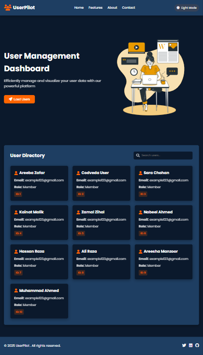

# Codveda Internship – Level 1 Task 3: Frontend Webpage

## ✅ Objective

Create a simple frontend using HTML, CSS, and JavaScript that fetches and displays data from a REST API.

## ✅ Features

- Static layout with "Fetch Users" button
- Dynamically loads data using `fetch()`
- Displays user info using DOM manipulation
- Responsive UI using custom CSS

## ✅ Tools Used

- HTML
- CSS
- JavaScript (Vanilla)

### 📸 Screenshots Preview

#### ✅ Initial Web Layout

#### ✅ Users Displayed

#### ✅ Search Functionality

#### ✅ Console Logs

#### ✅  Search Functionality with Fallback

#### ✅ Mobile Responsive View

#### ✅ Tablet Responsive View

#### ✅ Light Mode View

---

✨ **Areeba Zafar – Codveda Intern**
